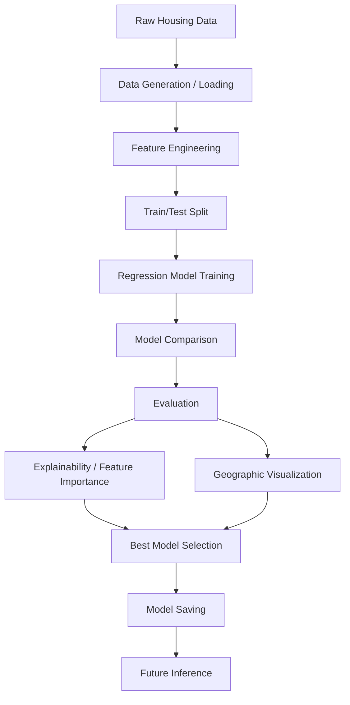

[README (1).md](https://github.com/user-attachments/files/30849119/README.1.md)
# 🏡 House Price Prediction Suite

**A complete machine learning regression pipeline for predicting house prices — from synthetic data generation to model explainability and geographic visualization.**


---

## 📑 Table of Contents

- [Overview](#-overview)
- [Objectives](#-objectives)
- [Features](#-features)
- [Architecture / Workflow](#-architecture--workflow)
- [Dataset](#-dataset)
- [Feature Engineering](#-feature-engineering)
- [Machine Learning Models](#-machine-learning-models)
- [Evaluation](#-evaluation)
- [Results](#-results)
- [Geographic Visualization](#-geographic-visualization)
- [Explainability](#-explainability)
- [Project Structure](#-project-structure)
- [Installation](#-installation)
- [Usage](#-usage)
- [Outputs](#-outputs)
- [Applications](#-applications)
- [Limitations](#-limitations)
- [Future Scope](#-future-scope)
- [License](#-license)
- [Author](#-author)

---

## 🔍 Overview

**House Price Prediction Suite** is an end-to-end regression project that predicts residential house prices using a self-contained, realistic **synthetic housing dataset**. The project covers the full machine learning lifecycle — data generation, real-estate-specific feature engineering, training and comparison of multiple regression models, rigorous evaluation, model explainability, and interactive geographic price visualization.

It is designed as a portfolio-quality project demonstrating practical, applied machine learning skills relevant to real estate analytics.

---

## 🎯 Objectives

This project aims to:

1. Generate or load a realistic housing dataset.
2. Perform real-estate-specific feature engineering.
3. Train and compare multiple regression algorithms.
4. Evaluate models using **MAE, RMSE, R², and MAPE**.
5. Analyze residuals and predicted-vs-actual performance.
6. Identify important features affecting house prices.
7. Visualize geographic price patterns using latitude and longitude.
8. Save the best-performing model for future inference.

---

## ✨ Features

- 🧱 Synthetic, realistic housing dataset with structural, geographic, and locality-based attributes
- 🛠️ Real-estate-specific feature engineering
- 🤖 Multiple regression models trained and benchmarked side by side
- 📊 Comprehensive evaluation using standard regression metrics
- 📉 Residual analysis and predicted-vs-actual diagnostics
- 🧠 Model explainability via feature importance / permutation importance
- 🗺️ Interactive geographic visualization of price patterns
- 💾 Best model persistence for future inference

---

## 🏗 Architecture / Workflow



---

## 📊 Dataset

The project uses a **synthetic but realistic housing dataset**, generated to reflect plausible structural and geographic housing patterns rather than a real-world proprietary dataset. When a raw dataset is not already available, the notebook can generate approximately **5,000 samples**.

The dataset includes the following attributes:

| Category | Attributes |
|---|---|
| **Target** | Price |
| **Structural** | Bedrooms, Bathrooms, Living Area / Square Footage, Lot Size, Year Built, Renovation Status, Property Quality, Property Type, Garage Spaces, Swimming Pool Availability |
| **Locality** | Neighborhood, School Rating, Crime Index, Distance to City Center |
| **Geographic** | Latitude, Longitude |

---

## 🛠 Feature Engineering

The project derives meaningful real-estate features from the raw housing attributes to improve model performance. Engineered features are drawn from **structural, geographic, location-related, amenity, and interaction** characteristics of a property, where supported by the underlying data.

> Specific engineered feature names are described generically here, since exact naming should be confirmed against the notebook's feature engineering cells.

---

## 🤖 Machine Learning Models

The project trains and compares multiple regression algorithms:

| Model | Status |
|---|---|
| Linear Regression | Core |
| Ridge Regression | Core |
| Lasso Regression | Core |
| ElasticNet | Core |
| Random Forest Regressor | Core |
| Gradient Boosting Regressor | Core |
| HistGradientBoosting Regressor | Core |
| XGBoost | Optional |
| LightGBM | Optional |
| CatBoost | Optional |

> Optional models (XGBoost, LightGBM, CatBoost) are supported when the corresponding libraries are installed; they are not assumed to have been run in every environment.

---

## 📐 Evaluation

Models are evaluated using the following quantitative metrics:

| Metric | Description |
|---|---|
| **MAE** | Mean Absolute Error — average magnitude of prediction errors |
| **RMSE** | Root Mean Squared Error — penalizes larger errors more heavily |
| **R² Score** | Proportion of variance in price explained by the model |
| **MAPE** | Mean Absolute Percentage Error — error expressed as a percentage |

In addition to numerical metrics, the project uses visual evaluation methods:

- 📈 Predicted vs Actual plots
- 📉 Residual plots
- 🌟 Feature importance / permutation importance
- 🗺️ Geographic price visualization

---

## 🏆 Results

> Insert actual results from the notebook below. Values are intentionally left blank as placeholders.

| Model                | MAE | RMSE | R² | MAPE |
| --------------------- | --: | ---: | -: | ---: |
| Linear Regression      |   — |    — |  — |    — |
| Ridge                  |   — |    — |  — |    — |
| Lasso                  |   — |    — |  — |    — |
| ElasticNet             |   — |    — |  — |    — |
| Random Forest          |   — |    — |  — |    — |
| Gradient Boosting      |   — |    — |  — |    — |
| HistGradientBoosting   |   — |    — |  — |    — |

The best-performing model is selected based on evaluation performance on the held-out test set once the above metrics are populated, rather than being assumed in advance.

---

## 🗺️ Geographic Visualization

Latitude and longitude attributes are used to visualize housing price patterns geographically, helping to reveal spatial trends such as price clustering by location. Interactive geographic visualization is produced using **Plotly**, where supported by the project.

---

## 🧠 Explainability

Model interpretation is performed using **feature importance** and **permutation importance** techniques, combined with visualizations to understand which housing characteristics contribute most to predicted prices. This helps translate model behavior into insights that are meaningful for real estate stakeholders.

---

## 📂 Project Structure

The project is currently implemented primarily in a single Jupyter Notebook. The folder structure below reflects a clean, GitHub-ready layout; additional folders are used to hold generated datasets, trained models, reports, and visualizations as the project is run.

```
House-Price-Prediction-Suite/
├── README.md
├── requirements.txt
├── .gitignore
├── LICENSE
├── notebooks/
│   └── House_Price_Prediction_Suite.ipynb
├── data/
│   ├── raw/
│   └── processed/
├── models/
├── reports/
├── assets/
└── src/
```

---

## ⚙️ Installation

Clone the repository and install the required dependencies:

```bash
git clone https://github.com/<YOUR_USERNAME>/House-Price-Prediction-Suite.git
cd House-Price-Prediction-Suite
pip install -r requirements.txt
jupyter notebook
```

If you prefer JupyterLab:

```bash
jupyter lab
```

---

## ▶️ Usage

1. Open `notebooks/House_Price_Prediction_Suite.ipynb`.
2. Run the cells sequentially from top to bottom.
3. Generate or load the synthetic housing dataset.
4. Perform feature engineering on the raw data.
5. Train and compare multiple regression models.
6. Review evaluation metrics and diagnostic visualizations.
7. Save and use the best-performing model for inference.

---

## 📤 Outputs

The following outputs are produced as the notebook is run (some are optional or generated on demand):

- `data/raw/house_prices.csv` — generated synthetic dataset
- Processed dataset (post feature engineering)
- Model evaluation metrics (MAE, RMSE, R², MAPE)
- Best trained model file (saved via Joblib)
- Predicted-vs-actual visualization
- Residual plots
- Feature importance analysis
- Geographic price visualization

> Only outputs actually produced by the notebook should be committed; generated files are typically excluded from version control via `.gitignore`.

---

## 💼 Applications

Potential real-world applications of this type of project include:

- Real estate property valuation
- Property investment analysis
- Mortgage and loan assessment support
- Real estate market analysis
- Buyer/seller decision support
- Geographic housing analysis

> These are potential use cases for this class of model. They are distinct from the specific features currently implemented in the notebook, which are described in the sections above.

---

## ⚠️ Limitations

- The dataset used is **synthetic**, not sourced from real-world property records.
- Model predictions are dependent on the quality and distribution of the generated data.
- Real-world housing markets involve additional factors (e.g., macroeconomic conditions, local regulations) that may not be represented.
- Optional libraries/models (XGBoost, LightGBM, CatBoost) may not be installed in every environment.
- Model performance metrics should **not** be interpreted as real-world property valuation accuracy.

---

## 🚀 Future Scope

- Integration of real-world housing datasets
- Hyperparameter optimization (e.g., grid search, Bayesian optimization)
- Web application deployment using Streamlit or Flask
- REST API deployment for model inference
- Cloud deployment (AWS / GCP / Azure)
- Advanced boosting and deep-learning models
- Real-time property data integration
- Improved geographic analytics (e.g., choropleth maps, spatial clustering)

---

## 📄 License

This project is licensed under the **MIT License**.

```
MIT License

Copyright (c) 2026 Sachin Kumbar

Permission is hereby granted, free of charge, to any person obtaining a copy
of this software and associated documentation files (the "Software"), to deal
in the Software without restriction, including without limitation the rights
to use, copy, modify, merge, publish, distribute, sublicense, and/or sell
copies of the Software, and to permit persons to whom the Software is
furnished to do so, subject to the following conditions:

The above copyright notice and this permission notice shall be included in all
copies or substantial portions of the Software.

THE SOFTWARE IS PROVIDED "AS IS", WITHOUT WARRANTY OF ANY KIND, EXPRESS OR
IMPLIED, INCLUDING BUT NOT LIMITED TO THE WARRANTIES OF MERCHANTABILITY,
FITNESS FOR A PARTICULAR PURPOSE AND NONINFRINGEMENT. IN NO EVENT SHALL THE
AUTHORS OR COPYRIGHT HOLDERS BE LIABLE FOR ANY CLAIM, DAMAGES OR OTHER
LIABILITY, WHETHER IN AN ACTION OF CONTRACT, TORT OR OTHERWISE, ARISING FROM,
OUT OF OR IN CONNECTION WITH THE SOFTWARE OR THE USE OR OTHER DEALINGS IN THE
SOFTWARE.
```

---

## 👤 Author

**Sachin Kumbar**

- GitHub: [`https://github.com/<YOUR_USERNAME>`](https://github.com/Sachinkumbar527)


---

<p align="center">⭐ If you find this project useful, consider starring the repository!</p>
